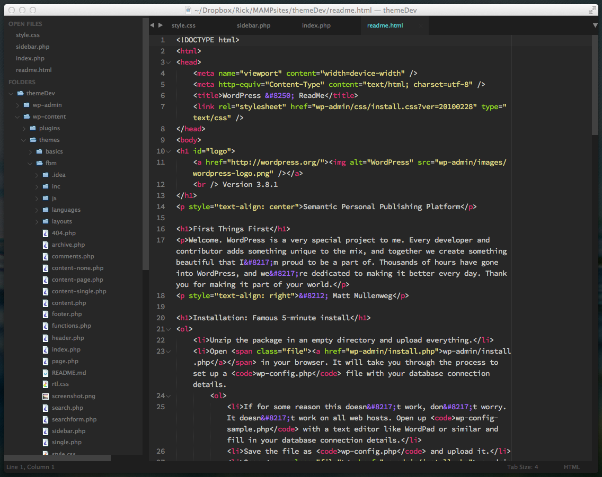

# [MonokaiHaze](https://github.com/ryentzer/MonokaiHaze)

A custom dark UI theme for Sublime Text 2/3.

***

### Themes

#### MonokaiHaze

This theme is based on the Spacegray UI theme modified to work with slightly more subtle Monokai colors.



***

### How to Install

You can also install the theme manually:

1. [Download the .zip](https://github.com/ryentzer/MonokaiHaze/archive/master.zip)
2. Unzip and rename the folder to `Theme - MonokaiHaze`
3. Copy the folder into the `Packages` directory, which you can find using the menu item `Sublime Text -> Preferences -> Browse Packages...`

***

### How to Activate

Activate the UI theme and color scheme by modifying your user preferences file, which you can find using the menu item `Sublime Text -> Preferences -> Settings - User` (⌘+, on Mac).

***Note: Don't forget to restart Sublime Text after activating the theme.***

#### Settings for MonokaiHaze

```
{
  "theme": "Monokai-haze.sublime-theme",
  "color_scheme": "Packages/Theme - MonokaiHaze/Monokai-haze.tmTheme"
}
```
